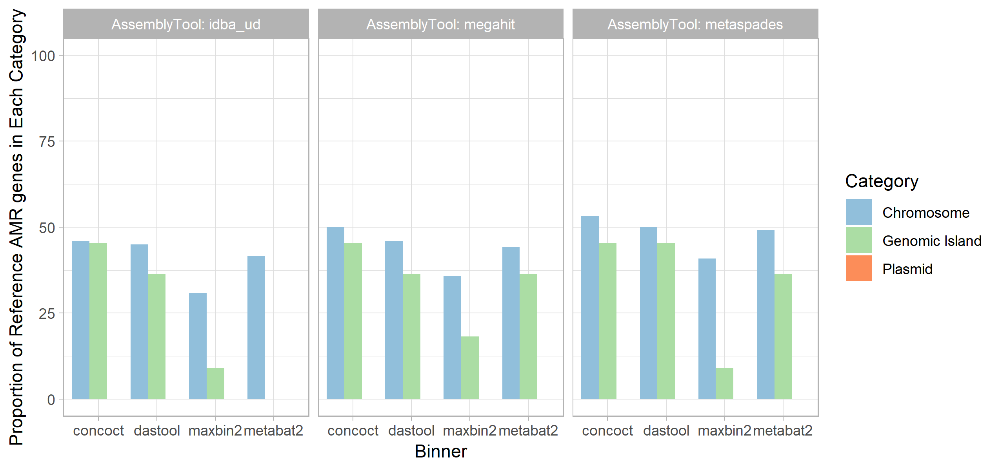
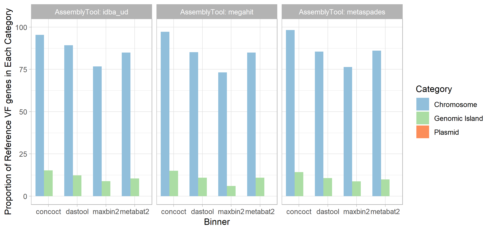

## Results {#results}

The overall ability of MAG methods to recapitulate the original chromosomal source genome results varied widely.
We consider the identity of a given MAG bin to be that of the genome that composes the largest proportion of sequence within that bin.
In other words if a bin is identifiably 70% species A and 30% species B we consider that to be a bin of species A.
Ideally, we wish to generate a single bin for each source genome comprised of the entire genome and no contigs from other genomes.
Some genomes are cleanly and accurately binned regardless of the assembler and binning method used (See Fig. (@fig:supspeciescov)).
Specifically, greater than 90% of _Streptomyces parvulus_ (minimum 91.8%) and _Clostridium baratii_ (minimum 96.4%) chromosomes are represented in individual bins across all methods.
However, no other genomes were consistently recovered by all methods for more than 1/3rd of the chromosomes.
The 3 _Streptococcus_ genomes were particularly problematic, likely due to their similarity, with the best recovery for each ranging from 1.7% to 47.49%.

{#fig:supspeciescov}

In terms of assembler, megahit resulted in the highest median chromosomal coverage across all binners (81.9%) with metaSPAdes performing worst (76.8%) (see Fig. (@fig:1topcoverage)).
In terms of binning tool, CONCOCT performed very poorly with a median 26% coverage for top hit per bin, followed by maxbin2 (83.1%), and metabat2 (88.5%).
It is perhaps unsuprising that the best performing binner in terms of bin top hit coverage was the metabinner DAS-TOOL that combines predictions from the other 3 binners (94.3% median top hit chromosome coverage per bin, (@fig:1topcoverage)).

{#fig:1topcoverage width="5in"}

Bin purity, i.e. the number of genomes present in a bin at >5% coverage, was largely equivalent across assemblers (see Fig. (@fig:1purity)), with a very marginally higher purity for IDBA.
In terms of binning tool, however, maxbin2 proved an outlier with nearly twice as many bins containing multiple species as the next binner.
The remaining binning tools were largely equivalent, producing chimeric bins at approximately the same rates.

{#fig:1purity width="5in"}

Regardless of method, a very small proportion of plasmids were correctly binned in the bin that mostly contained chromosomal contigs from the same source genome.
Specifically, between 1.5% (IDBA-UD assembly with DAS Tool bins) and 29.2% (metaSPAdes with CONCOCT bins) were correctly binned at over 50% coverage.
In terms of metagenome assembly MetaSPAdes was far and away the most successful assembler at assembling plasmids with 66.2% of plasmids identifiable at greater than 50% coverage.
IDBA-UD performed worst with 17.1% of plasmids recovered, and megahit recovered 36.9%.
If the plasmid was successfully assembled it was placed in a bin by maxbin2 and CONCOCT, although a much smaller fraction correctly binned (typically less than 1/3rd).
Interestingly, metabat2 and DAS tool binners were a lot more conservative in assigning plasmid contigs to bins, however, of those assigned to bins nearly all were correctly binned (see Fig. (@fig:2plasmids)).

{#fig:2plasmids width="5in"}

GIs displayed a similar pattern of assembly and correct binning performance as plasmids (see Fig. (@fig:3gis)).
These sequences were assembled uniformly badly (37.8-44.1%) with metaSPAdes outperforming the other two assembly approaches.
For CONCOCT and maxbin2 binning tools all GIs that were assembled were assigned to a bin although the proportion of binned GIs that were correctly binned was lower than for DAS Tool and metabat2.
DAS Tool, metabat2 and CONCOCT didn't display the same precipitious drop-off between those assembled and those correctly binned as was observed for plasmids.
In terms of overall correct binning with the chromosomes from the same genome the metaSPAdes assembly with CONCOCT (44.1%) and maxbin2 (43.3%) binners performed best.

{#fig:3gis width="5in"}

In term of gene content, we first explored the ability to find open reading frames (ORFs) within MAGs. 
Overall, the total number of predicted ORFs in MAGs followed a similar trend fo the chromosomal coverage and purity (@fig:4geneContent). 
Of the 4 binning tools, CONCOCT performed the worst, finding <30% of the number of ORFs in our reference genomes. Metabat2 performed second worst at ~80%. DASTool recovered a similar number to our reference and Maxbin2 seemed to predicted 7-46% more genes. The Assembler method did not significantly impact the number of genes predited with the exception of Maxbin2 in which idba_ud was the closest to reference and metaspades predicted 46% more ORFs. 

{#fig:4geneContent width="8in"}

First, we focused on the ability of MAGs to recover clinically relevant AMR genes (@fig5:AMRGenePercentRecoveryStage). After the assembly stage, we were only able to recover between ~49-55% of the AMR genes predicted in our reference genomes regardless of the assembly tool used, with metaspades performing marginally better than the others. 
Binning the contigs resulted in a ~1-15% loss in AMR gene recovery with concoct-metaSPAdes pair performing the best at 1% loss and dasTool-megahit performing the worst at 15% reduction of AMR genes recovered. 
Only 24% - 40% of all AMR genes were correctly binned with maxbin2-idba_ud performing the worst (24%) and concoct-metaSPAdes performing the best (40%). 
Moreover, focusing on only the genes that are correctly binned with respect to the reference replicon assigned to that bin (@fig6:AMRGenePercentRecoveryCorrectlyBinned). 
MAGs was able to correctly bin only 30%-53% of all chromosomally located AMR genes (n=120), 0-45% of genomic island located AMR genes (n=11) and none of the plasmid located AMR genes (n=20). 
Majority of the remaining genes was left unbinned and some were incorrectly binned. 

{#fig:5AMRGenePercentRecoveryStage width="15in"}
{#fig:6AMRGenePercentRecoveryCorrectlyBinned width="15in"}

Aside from AMR genes, we also examined virulence factors in our dataset using the virluence factor database (@fig7:VFGenePercentRecoveryStage).
We saw a similar trend as AMR genes. There was minor differences between the aseembler used in the amount of VF recovered after the assembly stage, with about 56-64% of VF genes recovered. Megahit was able to produce marginally better recovery with VFs. 
Similarly to AMR genes, binning the contigs again reduced the recovery between 4-26%, with dasTool-megahit performing the worst (26%) and concoct-metaSPAdes performing the best (4%). 
Unlike AMR genes, majority of the binned VF genes were correctly assigned to the right bin. Concoct-metaSPAdes again performed best 43% of all VFs correctly assigned. 
Again looking at the location of the VFs that were correctly assigned (@fig8:VFGenePercentRecoveryStage). MAGs was able to correctly bin majority (73%-98%) of all chromosomally located VF genes (n=757), 0-16% of genomic island located VF genes (n=809) and again none of the plasmid located VF genes (n=3). 

{#fig:7VFGenePercentRecoveryStage width="15in"}
{#fig:8VFGenePercentRecoveryStage width="15in"}
