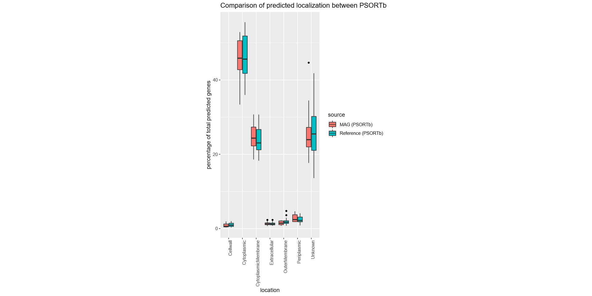

## Supplementals {#supplementals}

{#fig:supspeciescov}

{#fig:12subcellularLocalization width="15in"} 

We looked at the ability for MAGs to predict subcellular localization of proteins using PSORTb. Overall, the localization distribution of predicted proteins were very similar in MAGs compared to the reference genome (Fig. (@fig:12subcellularLocalization)).