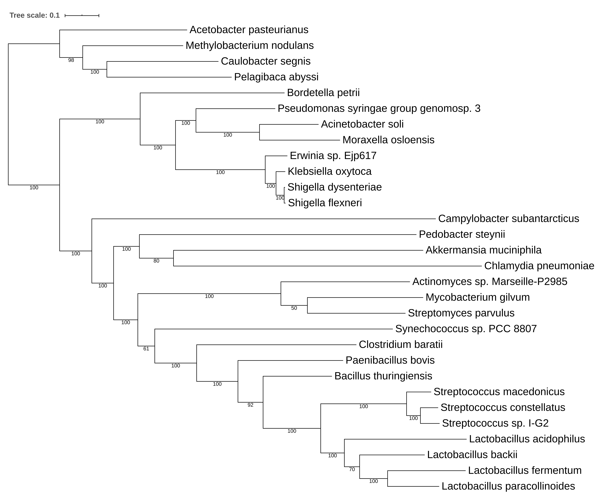

---
author-meta:
- Finlay Maguire*
- Baofeng Jia*
- Kristen Gray
- Wing Yin Venus Lau
- Robert G. Beiko
- Fiona S.L. Brinkman
bibliography:
- content/manual-references.json
date-meta: '2020-08-28'
header-includes: '<!--

  Manubot generated metadata rendered from header-includes-template.html.

  Suggest improvements at https://github.com/manubot/manubot/blob/master/manubot/process/header-includes-template.html

  -->

  <meta name="dc.format" content="text/html" />

  <meta name="dc.title" content="Metagenome-Assembled Genome Binning Methods with Short Reads Disproportionately Fail for Plasmids and Genomic Islands" />

  <meta name="citation_title" content="Metagenome-Assembled Genome Binning Methods with Short Reads Disproportionately Fail for Plasmids and Genomic Islands" />

  <meta property="og:title" content="Metagenome-Assembled Genome Binning Methods with Short Reads Disproportionately Fail for Plasmids and Genomic Islands" />

  <meta property="twitter:title" content="Metagenome-Assembled Genome Binning Methods with Short Reads Disproportionately Fail for Plasmids and Genomic Islands" />

  <meta name="dc.date" content="2020-08-28" />

  <meta name="citation_publication_date" content="2020-08-28" />

  <meta name="dc.language" content="en-CA" />

  <meta name="citation_language" content="en-CA" />

  <meta name="dc.relation.ispartof" content="Manubot" />

  <meta name="dc.publisher" content="Manubot" />

  <meta name="citation_journal_title" content="Manubot" />

  <meta name="citation_technical_report_institution" content="Manubot" />

  <meta name="citation_author" content="Finlay Maguire*" />

  <meta name="citation_author_institution" content="Faculty of Computer Science, Dalhousie University" />

  <meta name="citation_author_orcid" content="0000-0002-1203-9514" />

  <meta name="twitter:creator" content="@finlaym" />

  <meta name="citation_author" content="Baofeng Jia*" />

  <meta name="citation_author_institution" content="Department of Molecular Biology and Biochemistry, Simon Fraser University" />

  <meta name="citation_author_orcid" content="0000-0002-4735-4709" />

  <meta name="twitter:creator" content="@bfjia" />

  <meta name="citation_author" content="Kristen Gray" />

  <meta name="citation_author_institution" content="Department of Molecular Biology and Biochemistry, Simon Fraser University" />

  <meta name="citation_author_orcid" content="0000-0002-1962-189X" />

  <meta name="citation_author" content="Wing Yin Venus Lau" />

  <meta name="citation_author_institution" content="Department of Molecular Biology and Biochemistry, Simon Fraser University" />

  <meta name="citation_author_orcid" content="0000-0003-3884-4009" />

  <meta name="citation_author" content="Robert G. Beiko" />

  <meta name="citation_author_institution" content="Faculty of Computer Science, Dalhousie University" />

  <meta name="citation_author_orcid" content="0000-0002-5065-4980" />

  <meta name="citation_author" content="Fiona S.L. Brinkman" />

  <meta name="citation_author_institution" content="Department of Molecular Biology and Biochemistry, Simon Fraser University" />

  <meta name="citation_author_orcid" content="0000-0002-0584-4099" />

  <link rel="canonical" href="https://fmaguire.github.io/mag_sim_paper/" />

  <meta property="og:url" content="https://fmaguire.github.io/mag_sim_paper/" />

  <meta property="twitter:url" content="https://fmaguire.github.io/mag_sim_paper/" />

  <meta name="citation_fulltext_html_url" content="https://fmaguire.github.io/mag_sim_paper/" />

  <meta name="citation_pdf_url" content="https://fmaguire.github.io/mag_sim_paper/manuscript.pdf" />

  <link rel="alternate" type="application/pdf" href="https://fmaguire.github.io/mag_sim_paper/manuscript.pdf" />

  <link rel="alternate" type="text/html" href="https://fmaguire.github.io/mag_sim_paper/v/39740202e0f3f5e355b88d3733ebb894df513cad/" />

  <meta name="manubot_html_url_versioned" content="https://fmaguire.github.io/mag_sim_paper/v/39740202e0f3f5e355b88d3733ebb894df513cad/" />

  <meta name="manubot_pdf_url_versioned" content="https://fmaguire.github.io/mag_sim_paper/v/39740202e0f3f5e355b88d3733ebb894df513cad/manuscript.pdf" />

  <meta property="og:type" content="article" />

  <meta property="twitter:card" content="summary_large_image" />

  <link rel="icon" type="image/png" sizes="192x192" href="https://manubot.org/favicon-192x192.png" />

  <link rel="mask-icon" href="https://manubot.org/safari-pinned-tab.svg" color="#ad1457" />

  <meta name="theme-color" content="#ad1457" />

  <!-- end Manubot generated metadata -->'
keywords:
- markdown
- publishing
- manubot
lang: en-CA
manubot-clear-requests-cache: false
manubot-output-bibliography: output/references.json
manubot-output-citekeys: output/citations.tsv
manubot-requests-cache-path: ci/cache/requests-cache
title: Metagenome-Assembled Genome Binning Methods with Short Reads Disproportionately Fail for Plasmids and Genomic Islands
...

<small><em>
This manuscript
([permalink](https://fmaguire.github.io/mag_sim_paper/v/39740202e0f3f5e355b88d3733ebb894df513cad/))
was automatically generated
from [fmaguire/mag_sim_paper@3974020](https://github.com/fmaguire/mag_sim_paper/tree/39740202e0f3f5e355b88d3733ebb894df513cad)
on August 28, 2020.
</em></small>

## Authors

+ **Finlay Maguire*** 
    {.inline_icon}
    [0000-0002-1203-9514](https://orcid.org/0000-0002-1203-9514)
    · {.inline_icon}
    [fmaguire](https://github.com/fmaguire)
    · {.inline_icon}
    [finlaym](https://twitter.com/finlaym) 
  <small>
     Faculty of Computer Science, Dalhousie University
  </small>

+ **Baofeng Jia*** 
    {.inline_icon}
    [0000-0002-4735-4709](https://orcid.org/0000-0002-4735-4709)
    · {.inline_icon}
    [imasianxd](https://github.com/imasianxd)
    · {.inline_icon}
    [bfjia](https://twitter.com/bfjia) 
  <small>
     Department of Molecular Biology and Biochemistry, Simon Fraser University
  </small>

+ **Kristen Gray** 
    {.inline_icon}
    [0000-0002-1962-189X](https://orcid.org/0000-0002-1962-189X) 
  <small>
     Department of Molecular Biology and Biochemistry, Simon Fraser University
  </small>

+ **Wing Yin Venus Lau** 
    {.inline_icon}
    [0000-0003-3884-4009](https://orcid.org/0000-0003-3884-4009) 
  <small>
     Department of Molecular Biology and Biochemistry, Simon Fraser University
  </small>

+ **Robert G. Beiko** 
    {.inline_icon}
    [0000-0002-5065-4980](https://orcid.org/0000-0002-5065-4980) 
  <small>
     Faculty of Computer Science, Dalhousie University
  </small>

+ **Fiona S.L. Brinkman** 
    {.inline_icon}
    [0000-0002-0584-4099](https://orcid.org/0000-0002-0584-4099) 
  <small>
     Department of Molecular Biology and Biochemistry, Simon Fraser University
  </small>

## Abstract {#abstract}

Metagenomic methods enable the simultaneous characterisation of microbial communities without time-consuming and bias-inducing culturing. 
Metagenome-assembled genome (MAG) binning methods aim to reassemble individual genomes from this data. 
However, the recovery of mobile genetic elements (MGEs), such as plasmids and genomic islands (GIs), by binning has not been well characterised. 
Given the association of antimicrobial resistance (AMR) genes and virulence factor (VF) genes with MGEs, studying their transmission is a public health priority. 
The variable copy number and sequence composition of MGEs makes them potentially problematic for MAG binning methods. 
To systematically investigate this issue, we simulated a low-complexity metagenome comprising 30 GI-rich and plasmid-containing bacterial genomes. 
MAGs were then recovered using 12 current prediction pipelines and evaluated. 
While 82-94% of chromosomes could be correctly recovered and binned, only 38-44% of GIs and 1-29% of plasmid sequences were found. 
Strikingly, no plasmid-borne VF nor AMR genes were recovered, and only 0-45% of AMR or VF genes within GIs. 
We conclude that short-read MAG approaches without further optimisation are largely ineffective for the analysis of mobile genes, including those of public-health importance like AMR and VF genes. 
We propose that researchers should explore developing methods that optimise for this issue and consider also using unassembled short reads and/or long-read approaches to more fully characterise metagenomic data. 

## Keywords
Metagenomics, metagenome-assembled genomes, Antimicrobial resistance, Mobile genetic elements, Genomic islands.

## Author Notes
\* authors contributed equally.
All supporting data, code and protocols have been provided within the article or through supplementary data files. Four supplementary figures and three supplementary tables are available with the online version of this article.

## Abbreviations
MAG, Metagenome assembled genome. MGE, mobile genetic element. GI, genomic island. AMR, antimicrobial resistance. VF, virulence factor. ICE, integrative and conjugative element. 

## Impact Statement
Metagenome assembled genome (MAG) binning has become an increasingly common approach in environmental, microbiome, and public health studies that make use of short-read metagenomic data.
By examining 12 widely-used MAG binning workflows, we demonstrate that these methods are not suitable for the analysis of mobile genetic elements.
Given the potential human and animal health implications of antimicrobial resistance and virulence genes associated with these elements, inappropriate use of short-read MAGs has the potential to be misleading at best and harmful at worst.
This result will hopefully stimulate a fundamental shift in MAG methods to focus on developing methods optimised for these elements as well as incorporating additional read-based and long-read analyses.

## Data Summary
In keeping with FAIR principles (Findable, Accessible, Interoperable, Reusable data), all analyses presented in this paper can be reproduced and inspected with the associated github repository [https://github.com/fmaguire/MAG_gi_plasmid_analysis](github.com/fmaguire/MAG_gi_plasmid_analysis) (10.5281/zenodo.4005062) and data repository [https://osf.io/nrejs/](osf.io/nrejs/) (10.17605/OSF.IO/NREJS)

## Introduction {#main}

Metagenomics, the sequencing of DNA from within an environmental sample, is widely used to characterise the functional potential and identity of microbial communities [@doi:10.1073/pnas.202488399; @doi:10.1038/nbt.3935]. 
These approaches have been instrumental in developing our understanding of the distribution and evolutionary history of AMR genes [@doi:10.1016/j.cell.2014.08.032; @doi:10.1016/j.mib.2007.08.009; @doi:10.1038/nature10388], as well as tracking pathogen outbreaks [@doi:10.1001/jama.2013.3231].
Although long-read DNA technologies (e.g., Oxford Nanopore Technologies's (ONT) nanopore sequencing [@doi:10.1111/1755-0998.12324] and Pacific Biosciences' (PacBio) single-molecule real-time sequencing [@doi:10.1126/science.1162986] platforms) are now being used for metagenomic sequencing [@doi:10.1093/gigascience/giz043; @doi:10.1186/s12866-019-1500-0],  high-throughput sequencing of relatively short reads (150-250bp) in platforms such as the Illumina MiSeq still dominates metagenomics.
These reads can be directly analysed using reference databases and a variety of homology search tools (e.g., [@doi:10.1038/nmeth.3176; @doi:10.1038/nmeth.1923; @doi:10.1093/bioinformatics/btt403; @doi:10.1186/s12864-015-1419-2]).
Since these reads are shorter than most genes, however, read-based methods provide very little information about their genomic organisation.
This lack of contextual information is particularly problematic in the study of AMR genes and VFs as the genomic context plays a role in function [@doi:10.1128/AAC.01710-09], selective pressures [@doi:10.1016/j.tim.2006.02.006], and likelihood of lateral gene transfer (LGT) [@doi:10.1111/j.1574-6976.2011.00273.x].

Sequence assembly using specialised metagenomic de Bruijn graph assemblers (e.g., metaSPAdes [@doi:10.1101/gr.213959.116], IDBA-UD [@doi:10.1093/bioinformatics/bts174], and megahit [@doi:10.1093/bioinformatics/btv033]) is often used to try to recover information about genomic context [@doi:10.1038/nature02340].
To disentangle the resulting mix of assembled fragments, there has been a move to group these contigs based on the idea that those from the same source genome will have similar relative abundance and sequence composition [@doi:10.1093/bib/bbx120].
These resulting groups or "bins" are known as metagenome-assembled genomes (MAGs). 
A range of tools have been released to perform this binning including CONCOCT [@doi:10.1093/bioinformatics/btw290], MetaBAT 2 [@doi:10.7287/peerj.preprints.27522v1], MaxBin 2 [@doi:10.1093/bioinformatics/btv638], and a tool which combines their predictions: DAS Tool [@doi:10.1038/s41564-018-0171-1].
These MAG binning methods have been used successfully in unveiling previously uncharacterised genomic diversity [@doi:10.1038/nature14486; @doi:10.1038/s41564-017-0012-7; @doi:10.1101/489443], but metagenomic assembly and binning has been shown to involve the loss of some information.
This means as little as 24.2-36.4% of reads [@doi:10.1038/s41586-018-0338-1; @doi:10.1038/s41564-019-0449-y] and ~23% of genomes [@doi:10.1038/s41564-019-0449-y] are successfully assembled and binned in some metagenomic analyses.
The Critical Assessment of Metagenome Interpretation (CAMI) challenge's (https://data.cami-challenge.org/) Assessment of Metagenome BinnERs (AMBER) [@doi:10.1093/gigascience/giy069] benchmarks different MAG recovery methods in terms of global completeness and bin purity.
Similarly, a recent study has also used the AMBER approach to evaluate 15 different binning methods applied to a common metaSPAdes assembly [@doi:10.1186/s12859-020-03667-3].
However, to the best of our knowledge, there has not been a specific assessment of MAG-based recovery of mobile genetic elements (MGEs) such as genomic islands (GIs) and plasmids, despite their health and research importance.

Genomic islands (GIs) are clusters of chromosomal genes that are known or predicted to have been acquired through LGT events. 
GIs can arise following the integration of MGEs, such as integrons, transposons, integrative and conjugative elements (ICEs) and prophages (integrated phages) [@doi:10.1038/nrmicro2350; @doi:10.1038/nrg3962].
They are of high interest since virulence factors (VFs) are disproportionately associated with mobile sequences [@doi:10.1371/journal.pone.0008094] as well as certain antimicrobial resistance (AMR) genes [@doi:10.3389/fmicb.2016.00173; @doi:10.1016/j.plasmid.2015.01.001]. 
GIs often have differing nucleotide composition compared to the rest of the genome [@doi:10.1038/nrmicro2350], a trait exploited by GI prediction tools such as SIGI-HMM [@pmid:15113412], IslandPath-DIMOB [@doi:10.1093/bioinformatics/bty095], and integrative tools like IslandViewer [@doi:10.1093/nar/gkv401].
GIs may also exist as multiple copies within a genome [@doi:10.1093/bib/bby042] leading to potential assembly difficulties and biases in the calculation of coverage statistics.

Plasmids are circular or linear extrachromosomal self-replicating pieces of DNA with variable copy numbers and repetitive sequences [@doi:10.1038/s41559-016-0010; @doi:10.1128/AAC.00235-15].
Similar to GIs, the sequence composition and G+C content of plasmids are often markedly different from the genome with which they are associated [@doi:10.1093/bioinformatics/btq299; @doi:10.1093/molbev/msp281, @doi:10.1186/gb-2003-4-9-r57]. 
Plasmids are also of high interest as a major source of the lateral dissemination of AMR genes throughout microbial ecosystems [@pmid:26603922; @doi:10.3389/fmicb.2016.00173]. 

GIs and plasmids have proven particularly difficult to assemble from short-read sequencing data.
Due to the history of their integration at specific insertion sites, GIs are commonly flanked by direct repeats [@doi:10.1093/nar/30.4.866; @doi:10.1128/CMR.17.1.14-56.2004].
Repetitive sequences are known to complicate assembly from short reads, with repeats often found at contig break sites [@doi:10.1186/s12864-017-4429-4].
Given that assembly of closely related genomes in a metagenome is already challenging [@doi:10.1038/nmeth.4458], the polymorphic nature of GIs and known presence of flanking repeats would be expected to compound these separate assembly issues.
Repeats also inhibit the assembly of plasmids from short read sequencing data, particularly for longer plasmid sequences [@doi:10.1099/mgen.0.000128].
Additionally, the varying composition and relative abundance features mean that GIs and plasmids pose significant challenges in MAG recovery.

As these MGEs are key to the function and spread of pathogenic traits such as AMR and virulence, and with MAG approaches becoming increasingly popular within microbial and public-health research, it is both timely and vital that we assess the impact of metagenome assembly and binning on the recovery of these elements. 
Therefore, to address this issue we performed an analysis of GI and plasmid, and associated AMR/VF genes, recovery accuracy across a set of 12 state-of-the-art methods for short-read metagenome assemblies.
We show that short-read MAG-based analyses are not suitable for the study of mobile sequences, including those of public-health importance.

## Methods {#methods}

### Metagenome Simulation

Thirty RefSeq genomes were selected using IslandPath-DIMOB [@doi:10.1093/bioinformatics/bty095] GI prediction data collated into the IslandViewer database [www.pathogenomics.sfu.ca/islandviewer](www.pathogenomics.sfu.ca/islandviewer) [@doi:10.1093/nar/gkv401] (Supplemental Table 1).
The selected genomes and associated plasmids (listed in Supplemental Table 2 and deposited at osf.io/nrejs/ under "data/sequences") were manually selected to satisfy the following criteria: 10 genomes with 1-10 plasmids, 10 genomes with >10% of chromosomal DNA predicted to reside in GIs, and 10 genomes with <1% of chromosomal DNA predicted to reside in GIs.

In accordance with the recommendation in the CAMI challenge [@doi:10.1038/nmeth.4458] the genomes were randomly assigned a relative abundance following a log-normal distribution (μ = 1, σ = 2).
Plasmid copy number estimates could not be accurately found for all organisms. Therefore, plasmids were randomly assigned a copy number regime: low (1-20), medium (20-100), or high (500-1000) at a 2:1:1 rate.
Within each regime, the exact copy number was selected using an appropriately scaled gamma distribution (α = 4, β = 1) truncated to the regime range.

Finally, the effective plasmid relative abundance was determined by multiplying the plasmid copy number with the genome relative abundance.
The full set of randomly assigned relative abundances and copy numbers can be found in Supplemental Table 3.
Sequences were then concatenated into a single FASTA file with the appropriate relative abundance.
MiSeq v3 250 base pair (bp) paired-end reads with a mean fragment length of 1000bp (standard deviation of 50bp) were then simulated using art_illumina (v2016.06.05) [@doi:10.1093/bioinformatics/btr708] resulting in a simulated metagenome of 31,174,411 read pairs.
The selection of relative abundance and metagenome simulation itself was performed using the "data_simluation/simulate_metagenome.py" script.

### MAG Recovery

Reads were trimmed using sickle (v1.33) [@url:sickle] resulting in 25,682,644 surviving read pairs.
The trimmed reads were then assembled using 3 different metagenomic assemblers: metaSPAdes (v3.13.0) [@doi:10.1101/gr.213959.116], IDBA-UD (v1.1.3) [@doi:10.1093/bioinformatics/bts174], and megahit (v1.1.3) [@doi:10.1093/bioinformatics/btv033]).
The resulting assemblies were summarised using metaQUAST (v5.0.2) [@doi:10.1093/bioinformatics/btv697].
The assemblies were then indexed and reads mapped back using Bowtie 2 (v2.3.4.3) [@doi:10.1038/nmeth.1923].

Samtools (v1.9) was used to sort the read mappings, and the read coverage was calculated using the MetaBAT2 accessory script (jgi\_summarize\_bam\_contig\_depths).
The three metagenome assemblies were then separately binned using MetaBAT2 (v2.13) [@doi:10.7287/peerj.preprints.27522v1], and MaxBin 2 (v2.2.6) [@doi:10.1093/bioinformatics/btv638]. 
MAGs were also recovered using CONCOCT (v0.4.2) [@doi:10.1093/bioinformatics/btw290] following the recommended protocol in the user manual.
Briefly, the supplied CONCOCT accessory scripts were used to cut contigs into 10 kilobase fragments (cut\_up\_fasta.py) and read coverage calculated for the fragments (CONCOCT\_coverage\_table.py).
These fragment coverages were then used to bin the 10kb fragments before the clustered fragments were merged (merge\_cutup\_clustering.py) to create the final CONCOCT MAG bins (extra\_fasta\_bins.py).
Finally, for each metagenome assembly the predicted bins from these three binners (Maxbin2, MetaBAT 2, and CONCOCT) were combined using the DAS Tool (v1.1.1) meta-binner [@doi:10.1038/s41564-018-0171-1].
This resulted in 12 separate sets of MAGs (one set for each assembler and binner pair).

### MAG assessment

#### Synthetic Read Coverage and Depth
The trimmed synthetic reads was mapped back to each reference replicon using bowtie2 (v2.4.1), and sorted and indexed using samtools (v1.10). 
The coverage of each reference replicon is calculated using `samtools coverage` and the per base sequencing depth calculated using `samtools depth`. 
The average and per base depth are then plotted using R (v.3.4.2). 

#### Chromosomal Coverage

The MAG assessment for chromosomal coverage was performed by creating a BLASTN 2.9.0+ [@doi:10.1186/1471-2105-10-421] database consisting of all the chromosomes of the input reference genomes.
Each MAG contig was then used as a query against this database and the coverage of the underlying chromosomes tallied by merging the overlapping aligning regions and summing the total length of aligned MAG contigs.
The most represented genome in each MAG was assigned as the “identity” of that MAG for further analyses.
Coverage values of less than 5% were filtered out and the number of different genomes that contigs from a given MAG aligned to were tallied.
Finally, the overall proportion of chromosomes that were not present in any MAG was tallied for each binner and assembler.

In order to investigate the impact of the presence of closely related genomes in the metagenome on the ability to bin chromosomes we generated a phylogenetic tree for all the input genomes.
Single copy universal bacterial proteins were identified in the reference genomes using BUSCO v4.0.2 with the Bacteria Odb10 data [@doi:10.1093/bioinformatics/btv351].
The 86 of these proteins that were found in every reference genome were concatenated and aligned using MAFFT v7.427 [@doi:10.1093/bioinformatics/bty121] and masked with trimal v1.4.1-3 [@doi:10.1093/bioinformatics/btp348].
A maximum-likelihood phylogeny was then inferred with IQ-Tree v1.6.12 [@doi:10.1093/molbev/msu300] using 1000 ultrafast-bootstraps and the in-built ModelFinder determined partitioning [@doi:10.1093/molbev/mss020]. 
The phylogeny was then visualised using the interative Tree of Life (iToL) v4 [@doi:10.1093/nar/gkz239].
Pairwise branch distances were extracted from the resulting tree using ETE3 v3.1.1 [@doi:10.1093/molbev/msw046] and regressed using a linear model against coverage (via seaborn v0.10.0 [@doi:10.5281/zenodo.3629446]) and using a poisson logistic regression model (via statsmodel v0.12.0 [@doi:10.25080/MAJORA-92BF1922-011] against contamination.  R^2 and McFadden's pseudo-R^2 were calculated for each model respectively using the statsmodel library.

#### Plasmid and GI Coverage

Plasmid and GI coverage were assessed in the same way.
Firstly, a BLASTN database was generated for each set of MAG contigs.
Then each MAG database was searched for plasmid and GI sequences with greater than 50% coverage.
All plasmids or GIs which could be found in the unbinned contigs or MAGs were recorded as having been successfully assembled.
The subset of these that were found in the binned MAGs was then separately tallied.
Finally, we evaluated the proportion of plasmids or GIs that were correctly assigned to the bin that was maximally composed of chromosomes from the same source genome.

### Antimicrobial Resistance and Virulence Factors Assessment

#### Detection of AMR/VF Genes

For the reference genomes, as well as 12 sets of MAGs, prodigal [@doi:10.1186/1471-2105-11-119] was used to predict open reading frames (ORFs) using the default parameters. 
AMR genes were predicted using Resistance Gene Identifier (RGI v5.0.0; default parameters) and the Comprehensive Antibiotic Resistance Database (CARD v3.0.3) [@doi:10.1093/nar/gkz935].
Virulence factors were predicted using the predicted ORFs and BLASTX 2.9.0+ [@doi:10.1186/1471-2105-10-421] against the Virulence Factor Database (VFDB; obtained on Aug 26, 2019) with an e-value cut-off of 0.001 and a minimum identity of 90% [@doi:10.1093/nar/gky1080].
Each MAG was then assigned to a reference chromosome using the above-mentioned mapping criteria for downstream analysis.

#### AMR/VF Gene Recovery

For each MAG set, we counted the total number of AMR/VF genes recovered in each metagenomic assembly and each MAG and compared this to the number predicted in their assigned reference chromosome and plasmids.
We then assessed the ability for MAGs to correctly bin AMR/VF genes of chromosomal, plasmid, and GI origin by mapping the location of the reference replicon’s predicted genes to the location of the same genes in the MAGs.

## Results {#results}

### Recovery of Genomic Elements
#### Chromosomes 

The overall ability of MAG methods to recover the original chromosomal source genomes varied widely.
We considered the "identity" of a given MAG bin to be that of the genome that comprises the largest proportion of sequence within that bin.
In other words, if a bin is identifiably 70% species A and 30% species B we consider that to be a bin of species A.
Ideally, we wish to generate a single bin for each source genome consisting of the entire genome and no contigs from other genomes.
Some genomes are cleanly and accurately binned regardless of the assembler and binning method used (see Fig. @fig:speciescov).
Specifically, greater than 90% of _Streptomyces parvulus_ (minimum 91.8%) and _Clostridium baratii_ (minimum 96.4%) chromosomes are represented in individual bins across all methods.
However, no other genomes were consistently recovered at >30% chromosomal coverage across methods.
The three _Streptococcus_ genomes were particularly problematic with the best recovery for each ranging from 1.7% to 47.49%.
Contrary to what might be expected, the number of close relatives to a given genome in the metagenome did not clearly affect the MAG coverage (Fig. [S2](#fig:coverphylo)).

![Top genome coverage for input genomes across MAG binners. Each dot represents the coverage of a specified genome when it comprised the plurality of the sequences in a bin. If a genome did not form the plurality of any bin for a specific binner-assembler pair no dot was plotted for that genome and binner-assembler. The binning tool is indicated by the colour of the dot as per the legend. Genomes such as _Clostridium baratti_ were accurately recovered across all binner-assembler combinations whereas genomes such as _Streptococcus macedonicus_ were systematically poorly recovered.](images/F1_top_hits_per_bin.png){#fig:speciescov}

In terms of the impact of different metagenome assemblers, megahit resulted in the highest median chromosomal coverage across all binners (81.9%) with metaSPAdes performing worst (76.8%) (Fig. @fig:chromcoverpurity A).
Looking at binning tools, CONCOCT performed very poorly with a median 26% coverage for top hit per bin, followed by maxbin2 (83.1%), and MetaBAT2 (88.5%).
It is perhaps unsurprising that the best-performing binner in terms of bin top hit coverage was the metabinner DASTool that combines predictions from the other 3 binners (94.3% median top hit chromosome coverage per bin; (Fig. @fig:chromcoverpurity A)).

![Overall binning performance for every combination of metagenome assembler (as indicated by pane titles) and MAG binning tool (x-axis and legend colours). Diamonds in the plots represent outliers (greater or lower than the interquartile range marked by the error bars) and the boxes represent the lower quartile, median, and upper quartile respectively. **(A)** Chromosomal coverage of the most prevalent genome in each bin across binners and metagenome assemblies. Of the 3 assemblers, megahit resulted in the highest median chromosomal coverage (y-axis) across all binners (colored bars) at 81.9% with metaSPAdes performing the worst (76.8%). Of the 4 binners, CONCOCT (red) performed poorly with a median coverage, followed by maxbin2 (blue), MetaBAT2 (purple) and DASTool (green) performing the best. 
**(B)** Distribution of bin purity across assemblers and binners. The total number of genomes present in a bin at >5% coverage (y-axis) was largely equivalent across assemblers (x-axis). For the binning tools, maxbin2 (blue) produced nearly twice as many bins containing multiple species compared to CONCOCT (red), MetaBAT2 (purple) and DASTool (green), which all produced chimeric bins at roughly the same rate.](images/F2_bin_cover_purity_combined.png){#fig:chromcoverpurity}

Bin purity, i.e. the number of genomes present in a bin at >5% coverage, was largely equivalent across assemblers, with a very marginally higher purity for IDBA.
Across binning tools maxbin2 proved an exception with nearly twice as many bins containing multiple species as the next binner (Fig. @fig:chromcoverpurity B).
The remaining binning tools were largely equivalent, producing chimeric bins at approximately the same rates.
Unlike coverage, purity was potentially affected by the number of close relatives in the metagenome to a given input genome. 
Specifically, the closer the nearest relative the less pure the bin (Fig. [S3](#fig:purityphylo)), however, the proportion of variance explained by the regressions were very low for both analyses.
There was also not a clear relationship between coverage of a bin and purity with frequent observations of low purity but high coverage bins and pure but low coverage bins. 

#### Plasmids

Regardless of method, a very small proportion of plasmids were correctly grouped in the bin that was principally composed of chromosomal contigs from the same source genome.
Specifically, between 1.5% (IDBA-UD assembly with DASTool bins) and 29.2% (metaSPAdes with CONCOCT bins) were correctly binned at over 50% coverage.
In terms of metagenome assembly, metaSPAdes was by far the most successful assembler at assembling plasmids with 66.2% of plasmids identifiable at greater than 50% coverage.
IDBA-UD performed worst with 17.1% of plasmids recovered, and megahit recovered 36.9%.
If the plasmid was successfully assembled, it was, with one exception, placed in a MAG bin by maxbin2 and CONCOCT, although a much smaller fraction were correctly binned (typically less than 1/3rd).
Interestingly, the MetaBAT2 and DASTool binners were more conservative in assigning plasmid contigs to bins; of those assigned to bins, nearly all were correctly binned (Fig. @fig:plasmids).

![The performance of metagenomic assembly and binning to recover plasmid sequences. Each plot represents a different metagenome assembler, with the groups of bars along the x-axes showing the plasmid recovery performance of each binning tool when applied to the assemblies produced by that tool.  For each of these 12 assembler-binner-pair-produced MAGs the grouped bars from left to right show the percentage of plasmids assembled, assigned to any bin, and binned with the correct chromosomes.  These stages of the evaluation are indicated by the bar colours as per the legend.  Across all tools the assembly process resulted in the largest loss of plasmid sequences and only a small proportion of the assembled plasmids were correctly binned.](images/F3_plasmid_recovery.png){#fig:plasmids}

#### Genomic Islands

GIs were poorly assembled and correctly binned across methods (Fig. @fig:gis), although unlike plasmids, the performance of different methods were generally less variable.
Assembly of GIs with >50% coverage was consistently poor (37.8-44.1%) with metaSPAdes outperforming the other two assembly approaches.
For the CONCOCT and maxbin2 binning tools, all GIs that were assembled were assigned to a bin, although the proportion of binned GIs that were correctly binned was lower than for DASTool and MetaBAT2.
DASTool, MetaBAT2 and CONCOCT did not display the same precipitous drop between those assembled and those correctly binned as was observed for plasmids.
In terms of overall correct binning with the chromosomes from the same genome the metaSPAdes assembly with CONCOCT (44.1%) and maxbin2 (43.3%) binners performed best.

![Impact of metagenomic assembly and MAG binning on recovery of GIs. GIs were recovered in a similarly poor fashion to plasmids. Generally, \<40% were correctly assigned to the same bin majorly comprised of chromosomal contigs from the same source genome regardless of binning (x-axis) and assembly (panel) methods at >50% coverage. metaSPAdes performed the best at assembling GIs (blue). Maxbin2 and CONCOCT placed GIs in a bin majority of the time (orange) however a very small fraction was correctly binned (green). Generally, GIs were correctly binned better than plasmids with DASTool, MetaBAT2 and CONCOCT.](images/F4_gi_recovery.png){#fig:gis}

#### AMR Genes

The recovery of AMR genes in MAGs was poor with only ~49-55% of all AMR genes predicted in our reference genomes regardless of the assembly tool used, and metaSPAdes performing marginally better than other assemblers (Fig. @fig:AMRGenePercentRecoveryStageContext A).
Binning the contigs resulted in a ~1-15% loss in AMR gene recovery with the CONCOCT-metaSPAdes pair performing best at only 1% loss and DASTool-megahit performing the worst at 15% reduction of AMR genes recovered.
Overall, only 24% - 40% of all AMR genes were correctly binned.
This was lowest with the maxbin2-IDBA-UDA pair (24%) and highest in the CONCOCT-metaSPAdes pipeline (40%).

![Recovery of AMR genes across assemblers, binners, and genomic context. **(A)** The proportion of reference AMR genes recovered (y-axis) was largely similar across assembly tools (panels as indicated by title) at roughly 50% with metaSPAdes performing marginally better overall. Binning tools (x-axis) resulted in a small reduction in AMR genes recovered (orange), however only 24-40% of all AMR genes were correctly binned (green). metaSPAdes-CONCOCT was the best performing MAG binning pipeline. **(B)** Percent of correctly binned AMR genes recovered by genomic context. MAG methods were best at recovering chromosomally located AMR genes (light blue) regardless of metagenomic assembler or binning tool used. Recovery of AMR genes in GIs showed a bigger variation between tools (light green). None of the 12 evaluated MAG recovery methods were able to recover plasmid located AMR genes.](images/F5_amr_recovery_combined.png){#fig:AMRGenePercentRecoveryStageContext}

Moreover, focusing on only the AMR genes that were correctly binned (Fig. @fig:AMRGenePercentRecoveryStageContext B) we can evaluate the impact of different genomic contexts (i.e. chromosomal, plasmid, GI).
Across all methods only 30%-53% of all chromosomally located AMR genes (n=120), 0-45% of GI located AMR genes (n=11) and none of the plasmid-localised AMR genes (n=20) were correctly binned.

#### Virulence Factor Genes

We also examined the impact of MAG approaches on recovery of virulence factor (VF) genes as identified using the Virulence Factor Database (VFDB).
We saw a similar trend as AMR genes (Fig. @fig:VFGenePercentRecoveryStageCombined A).
Between 56% and 64% of VFs were identifiable in the metagenomic assemblies (with megahit recovering the greatest proportion).
The binning process further reduced the number of recovered VFs by 4-26% with DASTool-megahit performing the worst (26% reduction) and CONCOCT-metaSPAdes performing the best (4% reduction).
Unlike AMR genes, the majority of VF genes assigned to a bin were assigned to the correct bin (i.e. that bin largely made up of contigs from the same input genome).
Overall, CONCOCT-metaSPAdes again performed best with 43% of all VFs correctly assigned.

![Recovery of VF genes across assemblers, binners, and genomic context. **(A)** Percent of reference virulence factor (VF) genes recovered across assemblers and binners. The proportion of reference VF genes recovered (y-axis) exhibited a similar trend as AMR genes. Recovery was greatest after the assembling stage (blue), with megahit performing best. Binning tools resulted in a larger reduction in VF genes recovered (orange) compared to AMR genes. However, in the majority of cases, VF genes that are binned are correctly binned (green). metaSPAdes-CONCOCT was again the best performing pair. **(B)** Percent of correctly binned VF genes recovered in each genomic region. Metagenome assembled genomes (MAGs) were again best at recovering chromosomally located VF genes (light blue), able to correctly bin majority of chromosomally located VFs. GIs recovered again performed very poorly (light green) and again none of the plasmid located AMR genes (orange) was correctly binned.](images/F6_vf_recovery_combined.png){#fig:VFGenePercentRecoveryStageCombined}

As with AMR genes, the genomic context (chromosome, plasmid, GI) of a given VF largely determined how well it was binned (Fig. @fig:VFGenePercentRecoveryStageCombined B).
The majority (73%-98%) of all chromosomally located VF genes (n=757) were correctly binned.
However, 0-16% of GI-localised VF genes (n=809) and again none of the plasmid-associated VF genes (n=3) were recovered across all 12 MAG pipelines.

### Comparisons of Rates of Loss

We combined the performance metrics for Figs. @fig:plasmids, @fig:gis, @fig:AMRGenePercentRecoveryStageContext, and @fig:VFGenePercentRecoveryStageCombined to compare the rates of loss of different components (see Fig. [S5](#fig:rateofloss)).
This highlighted that genomic components (GIs and plasmids) and plasmids in particular are lost at a disproportionately higher rate than individual gene types during MAG recovery. 
This also emphasises that better metagenomic assembly doesn't necessarily result in better binning of GIs and plasmids. 

### Simulated Read Analysis

To further explore the potential causes of poor assembly and binning of MGEs we analysed the resultant coverage distribution from mapping our synthetically generated reads back to the original chromosomes, genomic islands, and plasmids from which they were simulated. 
This analysis identified that while coverage of our synthetic metagenome reads was >96% on average across all reference genomes, the coverage of GIs and plasmids displayed high levels of variance (Fig @fig:avgcoverage) with huge spikes and falls in read depth (see Fig. [S7](#fig:depthbyspp) and [S8](#fig:perbasedepth).
This variability in coverage can be attributed to repeated elements and compositional features in and around these MGEs.
This issue is likely responsible for failures to accurately estimate the read-depth/coverage in these regions, upon which both assembly (in traversal of the assembly graph) and binning rely. 

{#fig:avgcoverage}

## Discussion {#discussion}

In this paper, we evaluated the ability of metagenome-assembled genome (MAG) binning methods to correctly recover mobile genetic elements (MGEs; i.e. GIs and plasmids) from metagenomic samples.
Overall, chromosomal sequences were binned well (up to 94.3% coverage, with perfect bin purity using megahit-DASTool) however the presence of closely related genomes may have impacted cross-contaminated with other sequences (e.g. _Streptococcus_ species in Fig. [S2](#fig:coverphylo), [S3](#fig:purityphylo)).
The trade-off between false positives and sensitivity in the binning of closely related sequences is definitely an area in need of further exploration.  
Given the importance of MGEs in the function and spread of virulence traits and AMR, it is particularly noteworthy that regardless of MAG binning method, plasmids and GIs were disproportionately lost compared to core chromosomal regions. 
At best (with metaSPAdes and CONCOCT) 29.2% of plasmids and 44.1% of GIs were identifiable at >50% coverage in the correct bin (i.e. grouped with a bin that was mostly made up of contigs from the same genome). 
While some MGEs were likely recovered in more partial forms (<50% coverage), use of these by researchers interested in selective pressures and lateral gene transfer could lead to inaccurate inferences. 
This poor result is congruent with the intuition that the divergent compositional features and repetitive nature of these MGEs is problematic for MAG methods (a conclusion supported by the observed high coverage variability of MGEs when mapping simulated reads back to the original genomes).
The particularly poor plasmid binning performance is likely attributable to the known difficulties in assembly of plasmids from short-read data [@doi:10.1099/mgen.0.000128].
Therefore, binning efficiency might improve with use of long-read sequencing or assembly methods optimised for the assembly and binning of plasmids sequences [@doi:10.1099/mgen.0.000128] (such as SCAPP [@doi:10.1101/2020.01.12.903252]). 
Despite its lower effective sequencing depth and higher error rates, incorporating long-read data has been shown to improve overall MAG binning [@doi:10.1101/2020.04.08.032540] and facilitate metagenomic characterisation of plasmids [@doi:10.1186/s40168-019-0737-z].
However, the lower throughput of long-read technologies and high error rate of long-read methods presents a challenge when characterising MGEs in metagenomes, especially those of greater complexity.
Further research is needed to fully characterise the performance of different long-read protocols and analytical approaches (including hybrid approaches with short-reads) on the accuracy of recovering MGEs in metagenomic samples.

With the growing use of MAG methods in infectious disease research (e.g., [@doi:10.1099/mgen.0.000293; @doi:10.1016/j.envint.2019.05.036; @doi:10.1111/1462-2920.14989; @doi:10.3389/fmicb.2017.02036; @doi:10.1128/AEM.02577-16]) and the public-health and agri-food importance of the LGT of AMR and VF genes, we also specifically evaluated the binning of these gene classes.
The majority of these genes were correctly assembled across assemblers but were either not assigned or incorrectly assigned to MAG bins during binning.
At best across all binners, 40% of all AMR genes and ~63% of VF genes (CONCOCT-metaSPAdes) present in the reference genomes were assigned to the correct MAG.
While a majority of chromosomally located VF genes (73-98%) and AMR genes (53%) were binned correctly, only 16% of GI VFs (n=809), 45% of GI AMR genes (n=11), and not a single plasmid associated VF (n=3) or AMR gene (n=20) were correctly binned.
This included critical high-threat MGE-associated AMR genes such as oxacillinases (OXA) and _Klebsiella pneumoniae_ carbapenemases (KPC). 
One potential caveat of this is that some AMR genes and VFs may no longer be detectable in MAGs due to issues with ORF prediction (see suppl. discussion & [Fig. 
S3](#fig:geneContent)). 
We also observed a higher variability in both the read depth and read coverage in MGEs regions (Fig. @fig:avgcoverage, [S7](#fig:depthbyspp), and [S8](#fig:perbasedepth)). 
This, combined with previous studies observing fragmented ORG predictions in draft genomes, can lead to downstream over- or under-annotation with functional labels depending on the approach used [@doi:10.1186/1471-2164-13-14]. 
Although not yet developed, methods that combine the assembly/binning pipelines tested here with read-based inference would provide a better sense of which functions are potentially being missed by the MAG reconstructions.

Our simulated metagenomic community comprised 30 distinct bacterial genomes with varying degrees of relatedness. 
While this diversity can be representative of certain clinical samples [@doi:10.1186/s12879-017-2727-8; @doi:10.1128/JCM.42.11.5176-5183.2004; @doi:10.1038/s41598-017-07790-9], other environments with relevance to public health such as the human gut, soil, and livestock can have 100-1000s of species [@doi:10.1007/s00248-013-0344-7; @doi:10.1128/AEM.00592-09; @doi:10.1371/journal.pone.0006669; @doi:10.1038/s41598-017-12481-6].
In addition, MGEs such as GIs and plasmids are known to recombine, producing closely related variants [@doi:10.1016/j.micinf.2005.12.028; @doi:10.1128/JB.186.7.2115-2122.2004; @doi:10.1038/s41467-020-17278-2] that could further complicate assembly from a metagenomic sample.
Polymorphic MGEs were not deliberately introduced in our simulated metagenome.
Consequently, our analysis likely over-represents the effectiveness of the methods tested in a public-health setting. 
Metagenomic simulation is also unlikely to perfectly represent the noise and biases in real metagenomic sequencing but it does provide the ground-truth necessary for evaluation [@doi:10.1093/gigascience/giy069; @doi:10.1186/s40168-019-0633-6].
This simulation approach, combined with the development of an MGE/AMR-focused mock metagenome (similarly to the mockrobiota initiative [@doi:10.1128/mSystems.00062-16]), could provide a key resource to develop and validate new binning approaches and different sequencing strategies.
Additionally, it would provide a way to further optimise parameter settings of existing metagenomic assembly and binning tools beyond the default settings used in these analyses (considered representative of most "real-world" usage [@doi:10.1093/bib/bbw134]) without overfitting to a particular metagenome. 

This study has shown that while short-read MAG-binning approaches provide a useful tool to study a bacterial species’ core chromosomal elements they have severe limitations in the recovery of MGEs.
The majority of these MGEs will either fail to be assembled or be incorrectly binned.
The consequence of this is the disproportionate loss of key public-health MGE-associated VFs and AMR genes that may be crucial markers for monitoring the spread of virulence and resistance among clinically important pathogens.
As many of these clinically relevant genes have a high propensity for lateral gene transfer between unrelated bacteria [@doi:10.1371/journal.pone.0008094;@doi:10.3389/fmicb.2016.00173] it is critical to highlight that MAG approaches alone are currently insufficient to thoroughly profile them.
Within public-health metagenomic research, as well as other research areas that study MGEs, it is vital we utilise MAGs in conjunction with other methods (e.g. targeted AMR [@doi:10.1099/mgen.0.000131], long-read sequencing, plasmid specialised assembly approaches [@doi:10.1101/2020.01.12.903252], and read-based sequence homology search [@doi:10.1038/nmeth.3176]) before drawing biological or epidemiological conclusions.

## Supplementary Information {#supplementals}

### Impact of Related Genomes on MAG binning

By generating a phylogeny of universal single copy genes in our input genomes (Fig. [S1](#fig:phylo)) we analysed the relationship between the presence of closely related genomes and the ability of the different MAG-recovery methods to bin chromosomal sequences.
Specifically, we regressed phylogenetic distance on this phylogeny with per-bin chromosomal coverage (Fig. [S2](#fig:coverphylo)) and bin purity (Fig. [S3](#fig:purityphylo)).
This identified no clear relationship between chromosomal coverage and the phylogenetic distance to the nearest relative in the metagenome (Fig. [S2](#fig:coverphylo)), however, there did seem to be a weak potential negative correlation between phylogenetic distance to closest relative and the purity of a MAG bin (Fig. [S2](#fig:purityphylo)).
In other words, across all methods, a MAG bin was more likely to have multiple genomes present if there were close relatives.

{#fig:phylo, tag="S1}

![Relationship between phylogenetic distance to closest neighbour input genome on genomic coverage in MAG majority comprised of that taxon. Each dot represents the genomic coverage of a particular genome and the branch distance on an 86-protein concatenated phylogeny between that genome and its nearest neighbour. Rows indicate the binning software and columns the metagenomic assembler. Regression line is a simple linear model fitted in seaborn with R^2 values calculated and annotated on each plot. ](images/S2_best_coverage_phylo_dist.png){#fig:coverphylo, tag="S2"}

{#fig:purityphylo, tag="S3"}

### Recovery of Specific Gene Content

We explored the ability of different approaches to find open reading frames (ORFs) within MAGs.
Overall, the total number of predicted ORFs in MAGs followed a similar trend (Fig. [S4](#fig:geneContent)) as the chromosomal coverage and purity (Fig. @fig:chromcoverpurity).
Of the four binning tools, CONCOCT performed the worst, finding <30% of the number of ORFs in our reference genomes used to construct the synthetic data.
MetaBAT2 performed second worst at ~80%.
DASTool recovered a similar number to our reference and Maxbin2 detected 7-46% more genes.
The Assembler method did not significantly impact the number of genes predicted with the exception of Maxbin2, in which IDBA\_UD was the closest to reference and metaSPAdes predicted 46% more ORFs.
Given that there is reason to suspect that there are some issues with the ORF calling in the MAGs. i.e. some tools produced more predicted ORFs than reference, it could be the case that some of these sequences are present in the assemblies (with errors/gaps), but are not being identified as ORFs, or are broken into multiple ORFs, leading to issues downstream labeling them correctly as AMR/VF genes. 
Regardless of different tools producing a different number of ORFs, the recovery of AMR/VF is pretty consistent regardless of how many ORFs are predicted.

{#fig:geneContent, tag="S4"}

### Comparisons of Rates of Loss

Combining the performance metrics for Figs. @fig:plasmids, @fig:gis, @fig:AMRGenePercentRecoveryStageContext, and @fig:VFGenePercentRecoveryStageCombined to compare the rates of loss of different components emphasises some of the observed patterns (see Fig. [S5](#fig:rateofloss)).
This highlights that genomic components (GIs and plasmids) and plasmids in particular are lost at a higher rate than individual gene types during MAG recovery.

{#fig:rateofloss, tag="S5"}

{#fig:geneContent, tag="S6"}

### Detailed Simulated Read Depth Analysis

{#fig:depthbyspp, tag="S7"}

{#fig:perbasedepth, tag="S8"}

## Data Bibliography

All datasets used or generated in this study are available at [https://osf.io/nrejs](osf.io/nrejs/)
All analysis and plotting code used is available at [https://github.com/fmaguire/MAG_gi_plasmid_analysis](github.com/fmaguire/MAG_gi_plasmid_analysis)

## Funding Information

This work was supported primarily by a Donald Hill Family Fellowship held by F.M.
W.Y.V.L. and B.J. hold Canadian Institutes of Health Research (CIHR) doctoral scholarships.
K.G. was supported by a Natural Sciences and Engineering Research Council of Canada (NSERC) Collaborative Research and Training Experience (CREATE) Bioinformatics scholarship.
B.J, W.Y.V.L., and K.G. also held Simon Fraser University (SFU) Omics and Data Sciences fellowships.
F.S.L.B. holds an SFU Distinguished Professorship and R.G.B. is a Professor and Associate Dean Research at Dalhousie University.
Additionally, this work was partially supported by Genome Canada and NSERC grants to R.G.B. and F.S.L.B.

## Acknowledgements
The authors would like to thank their funders and the Simon Fraser University (SFU) Research Computing Group and Compute Canada for compute resource support.

## Author contributions

F.M. and B.J.: conceptualization, investigation, validation, formal analysis, data curation, writing (original draft preparation; review and editing), visualization. 
W.Y.V.L. and K.G.: investivation, data curation writing (review and editing). 
F.S.L.B and R.G.B.: Supervision, Project administration, funding, writing (review and editing).
All authors contributed to and approved the manuscript.

## Conflict of Interest

The authors declare no competing interests.

## References {#references}
