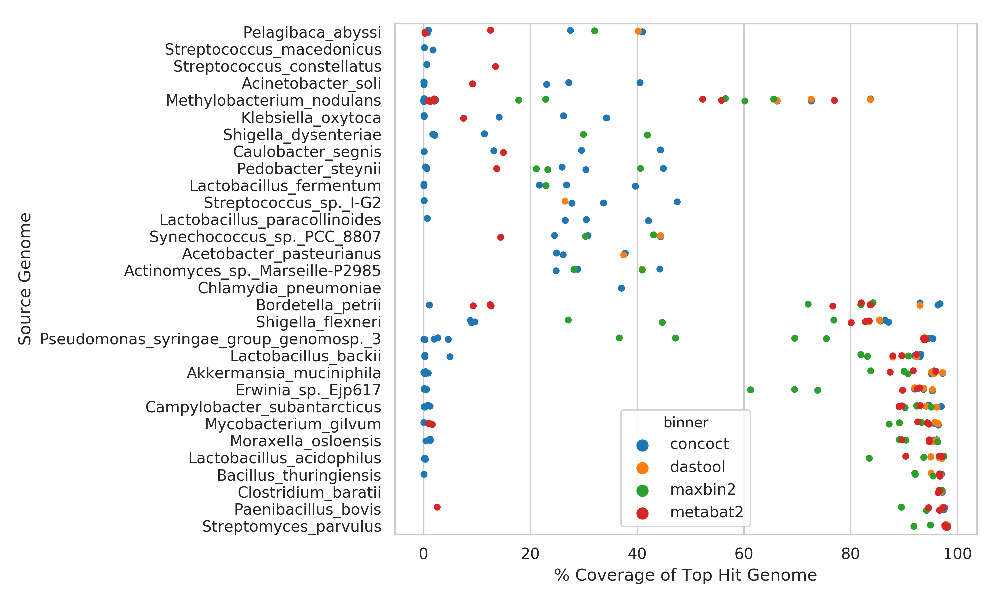
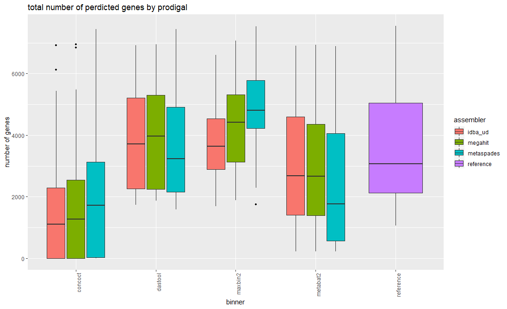

---
author-meta:
- Finlay Maguire*
- Baofeng Jia*
- Kristen Gray
- Venus Lau
- Robert G. Beiko
- Fiona S.L. Brinkman
date-meta: '2019-12-02'
keywords:
- markdown
- publishing
- manubot
lang: en-CA
title: Metagenome-Assembled Genome Binning Methods Disproportionately Fail for Plasmids
  and Genomic Islands
...

<small><em>
This manuscript
([permalink](https://fmaguire.github.io/mag_sim_paper/v/1ac9a88a7499455bd9d9d30b59f77ddeb6ce6296/))
was automatically generated
from [fmaguire/mag_sim_paper@1ac9a88](https://github.com/fmaguire/mag_sim_paper/tree/1ac9a88a7499455bd9d9d30b59f77ddeb6ce6296)
on December 2, 2019.
</em></small>

## Authors
Please note the current author order is chronological and does not reflect the final order.

+ **Finlay Maguire*** 
    {.inline_icon}
    [0000-0002-1203-9514](https://orcid.org/0000-0002-1203-9514)
    · {.inline_icon}
    [fmaguire](https://github.com/fmaguire)
    · {.inline_icon}
    [fmaguire](https://twitter.com/fmaguire) 
  <small>
     Faculty of Computer Science, Dalhousie University
     · Funded by ['Genome Canada', 'Donald Hill Family Fellowship']
  </small>

+ **Baofeng Jia*** 
    {.inline_icon}
    [XXXX-XXXX-XXXX-XXXX](https://orcid.org/XXXX-XXXX-XXXX-XXXX)
    · {.inline_icon}
    [imasianxd](https://github.com/imasianxd) 
  <small>
     Department of Biochemistry and Molecular Biology, Simon Fraser University
  </small>

+ **Kristen Gray** 
    {.inline_icon}
    [XXXX-XXXX-XXXX-XXXX](https://orcid.org/XXXX-XXXX-XXXX-XXXX) 
  <small>
     Department of Biochemistry and Molecular Biology, Simon Fraser University
  </small>

+ **Venus Lau** 
    {.inline_icon}
    [XXXX-XXXX-XXXX-XXXX](https://orcid.org/XXXX-XXXX-XXXX-XXXX) 
  <small>
     Department of Biochemistry and Molecular Biology, Simon Fraser University
  </small>

+ **Robert G. Beiko**  
  <small>
     Faculty of Computer Science, Dalhousie University
  </small>

+ **Fiona S.L. Brinkman** 
    {.inline_icon}
    [XXXX-XXXX-XXXX-XXXX](https://orcid.org/XXXX-XXXX-XXXX-XXXX) 
  <small>
     Department of Biochemistry and Molecular Biology, Simon Fraser University
  </small>

## Abstract {#abstract}

**final numbers to add**

Metagenomic methods, in which all the DNA in sample is simultanously sequenced, is an increasingly popular method in the life sciences.
They have a major advantage over genomic or phenotypic methods as they do not require time-intensive and bias-inducing culturing steps.
This means a much greater diversity can be profiled with minimal _a priori_ assumptions.
Due to this strength, metagenomics is emerging as a key tool in public health microbiology for surveillance of virulence and antimicrobial resistance (AMR) genes.
The most important sequences for surveillance purposes are those associated with mobile genetic elements such as plasmids and genomic islands (GIs).
Unfortunately, metagenomic data, even when assembled, results in complex mixed set of DNA fragments rather than nicely resolved individual genomes.
Recently, methods have been developed that attempt to group these fragments into bins likely to have been derived from the same underlying genome.
These bins are commonly known as metagenome-assembled genomes (MAGs). 
MAG based approaches have been used to great effect in revealing huge amounts of previously uncharacterised microbial diversity.
These methods perform this grouping using aspects of the sequence composition and the relative abundance of that sequence in the dataset.
Unfortunately, plasmids are often represented at different copy numbers than the corresponding chromosomes. 
Additionally, both plasmids and genomic islands often feature significantly different sequence composition than the rest of the source genome as a whole.
Due to this we hypothesise these types of sequences will be highly under-represented in MAG based approaches.

To evaluate this we generated a simulated metagenomic dataset comprised of genomes with large numbers of plasmids and considerable proportion of chrosomomal DNA consisting of GIs at varying relative abundances.
MAGs were then recovered from this data using a variety of different established MAG pipelines and parameterisations and correct binning of plasmid and GI sequences calculated relative to the genomes as a whole.
We show that regardless of the MAG approach used, plasmid and GI dominated sequences will systematically be left unbinned or incorrectly binned.
This indicates the importance of read based approaches for thorough evalaution of resistome complements in metagenomic data.

## Introduction {#intro}

Metagenomics, the untargeted sequencing of all DNA within a sample, has become the dominant approach for characterising viral and microbial communities over the last 17 years [@8PLOeAH6; @7RV1Ygsv]. 
By sampling from the total genomic content these methods allow researchers to profile the functional potential and the taxonomic composition of a sample. 
This is in contrast to bar-coding based approaches such as 16S or 18S rRNA sequencing which only provide taxonomic information [@Trbw5ZnC] (although you can attempt to predict functional potential from taxonomic data [@93ojQnSg; @L09Dmaq3]). 
One of many areas where metagenomics has been very useful is in the analysis of antimicrobial resistance (AMR) and pathogen virulence. 
These approaches have been instrumental in developing our understanding of the distribution and evolutionary history of AMR genes [@rwhLEYRY; @QSe5BqFk; @2xaXclNM]. 
It has also formed a key tool for pathogen tracking in public health outbreak analyses [@khJQfjDf]

While 3rd generation long-read technology has begun to be adopted in metagenomics analyses [@U4vhNZoB; @1759XyDVi] the majority of analyses still involve high-throughput 2nd generation sequencing. 
These 2nd generation platforms such as Illumina's MiSeq provide high numbers (10s-100s of millions) of relatively short reads (150-250bp) randomly sampled from the underlying DNA in the sample. 
This sampling is therefore in proportion to the relative abundance of different organisms (i.e. more abundant organisms will be more represented in the reads). 
There are 2 main approaches for the analysis of 2nd generation metagenomic data: read homology and metagenome assembly. 
Read-based approaches involve using reference databases and BLAST-based sequence similarity search tools (e.g. DIAMOND [@4R96QRcV]), read mapping (e.g. Bowtie 2 [@PiS0h6Mu]), Hidden Markov Models (e.g. HMMER3 [@77xWEk9S]) or k-mer hashing (e.g. CLARK [@OoKZ0WcH]). 
These read-based approaches allow analysis of all reads with detectable similarity to genes of interest even if the organism is relatively under-represented in the dataset. 
However, read-based methods are reliant on quality of the reference database (i.e. you don't detect things you don't already know about) and does not provide any information about the genomic organisation of the genes.
This lack of contextual information is particularly problematic in the study of AMR genes and virulence factors as the genomic context plays a role in function [@17Dww6tOF], selective pressures [@1BcFmOfCH], and how liable the sequence is to lateral gene transfer (LGT) [@SACLvb9k].

In order to get more data about the relative genomic context and organisation of your genes of interest it is possible (although computationally demanding) to assemble the short reads into longer fragments of DNA (contigs). 
This approach has been used successfully in even very early metagenomic analysis papers [@F7RexqdF]. 
There are a variety of specialised _de Bruijn_ graph assemblers developed to handle the particular challenges of this type of assembly (such as metaSPAdes [@KP5SjPXN] , IDBA-UD [@a4mT7fuU], and megahit [@1EUV0Ejkr]) each with a range of different strengths and weaknesses [@f0X2CPKM]. 
While metagenomic assembly does provide longer stretches of DNA incorporating information about multiple genes without further analysis it still leaves you with a large collection of DNA fragments with no obvious groupings. 

An increasingly common way to deal with this is to attempt to group these assembled contigs into bins all derived from the same underlying genome in the sample. 
These resulting bins are known as metagenome assembled genomes (MAGs). 
This binning is typically performed by grouping all the contigs with similar abundance and similar sequence composition into the same bin. 
A range of tools have been released to perform this binning including CONCOCT [@WRoCf6pg], MetaBAT 2 [@b2WO18xh], and MaxBin 2 [@sG4CX8Uj]. 
There is also the meta-binning tool DAS Tool [@DfIRBmdF] which combines predictions from multiple binning tools together. 
These MAG approaches have been used to great effect in unveiling huge amounts of previously uncharacterised genomic diversity [@4rsFboY4; @wrBRBdFb; @Rk2NATlI].

Unfortunately, there is loss of information at both the metagenomic assembly step (e.g. repetitive DNA sequences that are difficult to correctly assemble with short reads) [@UWOTvAMZ,@12zFifp5x] and in binning.
This compounded data loss means that only a relatively small proportion of reads are actually successfully assembled and binned in large complex metagenome datasets e.g. 24.2-36.4% of reads from permafrost [@buqrbdBh] and soil metagenomes [@d5Hh0941]. 
Additionally, a large number of detected genomes are not reconstructed at all, only ~23% of all detected genomes were recovered in some examples [@d5Hh0941]. 
There have been attempts to benchmark and compare the assembly and binning tools such as the Critical Assessment of Metagenome Interpretation (CAMI) challenge's (https://data.cami-challenge.org/) Assessment of Metagenome BinnERs (AMBER) [@Y8sHlHi] however these largely investigate the overall completeness and purity of recovered MAGs relative to the known genomes in the evaluation samples.
To our best knowledge, there hasn't been a specific assessment of the impact of metagenomic assembly and binning on the loss of specific genomic elements.
Two such genomic elements of great importance to the study and LGT of AMR and virulence factors are genomic islands and plasmid sequences.

Genomic islands (GIs) are clusters of genes known or predicted to have been acquired through LGT events. 
These include integrons, transposons, integrative and conjugative elements (ICEs) and prophages (integrated phages) [@DET3tBYj; @1Af4oXwEX]. 
They have been shown to disproportionately encode virulence factors [@LxGqo7iq] and are a major mechanism of LGT of AMR genes [@x7HhCKyS; @17U91060Y]. 
However, these GIs often have different nucleotide composition compared to the rest of the genome [@DET3tBYj], which is exploited by tools such as SIGI-HMM [@19UeQywMr] and IslandPath-DIMOB [@M1pdcdMy] to detect GIs. 
GIs may exist as multiple copies within a genome [@5g9Xc4ot] leading to potential difficulties in correctly assembling these regions in metagenome assemblies as well as likely biases in the calculation of coverage statistics. 
Similarly, plasmids, circular or linear extrachromosomal self-replicating pieces of DNA, are a major source of the dissemination of AMR genes throughout microbial ecosystems [@X9j9vETu; @x7HhCKyS]. 
Due to their research priority, lots of work has identified the difficulty of assembling these sequences correctly from short-read data [@12zFifp5x,@bkwNETh8].
This is largely due to containing repetitive sequences, having variable copy number [@qtpTcNWp; @Z1irb7eF] and often markedly different sequence composition to the genome they are associated with [@QK9dmRUA; @ps1aOiRU]. 

As MAG binning is performed on the basis of sequence composition and coverage this suggests that these sequences are liable to being incorrectly binned or lost in the process of recovering MAGs. 
Due to the importance of these genomic components in the function and spread of pathogenic traits such as AMR and virulence it is vital that we assess the impact of metagenome assembly and binning on the representation of these specific elements. 
This is particularly important with the increasing popularity of MAG approaches within microbial and public health research. 
Therefore, to address this issue we performed an analysis of GI and plasmid recovery accuracy across a broad-set of current state-of-the-art short-read metagenome assembly and binning approaches using a simulated medium complexity metagenome comprised of GI- and plasmid-rich taxa.

## Materials and Methods {#methods}

All analyses presented in this paper can be reproduced and inspected using the Jupyter (version XX) [citation] notebook (.ipynb) within the associated github repository (https://github.com/fmaguire/MAG\_gi\_plasmid\_analysis).
The specific code version used for this paper is also archived under DOI:XXXYYY.

### Metagenome Simulation

All genomes were selected from the set of completed RefSeq genomes as of April 2019.  
Genomic islands for these genomes were previously predicted using IslandPath-DIMOB [@M1pdcdMy] and collated into the IslandViewer database (http://www.pathogenomics.sfu.ca/islandviewer) [@4eEyIkDg].
Plasmid sequences and numbers were recovered for each genome using the linked genbank Project IDs.

30 genomes were manually selected to exemplify the following criteria:
    - 10 genomes with high numbers of plasmids
    - 10 genomes with a very high proportion (\>10%) of chromosomes corresponding to GIs detected by compositional features.
    - 10 genomes with a very low proportion (\<1%) of chromosomes corresponding to GIs detected by compositional features.

The data used to select the taxa is listed in Supplemental Table 1 and the details of the selected subset taxa are listed in Supplemental Table 2 with their NCBI accessions.
The sequences themselves are in `data/sequences/sequences.tar.bz2` of the linked analysis repository above.

In accordance to the recommendation in the CAMI challenge [@lsbnKJf8] the genomes were randomly assigned a relative abundance following a log-normal distribituion (\mu = 1, \sigma = 2).
Plasmid copy number estimates could not be accurately found for all organisms, therefore, plasmids were randomly assigned a copy number regime: low (1-20), medium (20-100), or high (500-1000) at a 2:1:1 rate.
Within each regime the exact copy number was selected using an appropriately scaled gamma distribution (\alpha = 4, \beta = 1) or the minimum edge of the regime.
Finally, the effective plasmid relative abundance was determined by multiplying the plasmid copy number with the genome relative abundance.
The full set of randomly assigned relative abundances and copy numbers can be found in Supplemental Table 3.

Sequences were then concatenated into a single fasta file with the appropriate relative abudance. 
MiSeq v3 250bp paired-end reads with a mean fragment length of 1000bp (standard deviation of 50bp) were then simulated using art\_illumina (v2016.06.05) [@znONJtTo] at a fold coverage of 2.9 resulting in a simulate metagenome of 31,174,411 read pairs.

The selection of relative abundance and metagenome simulation itself was performed using the `data_simluation/simulate_metagenome.py` script.

### Metagenome Assembled Genome Recovery

Reads were trimmed using sickle (v1.33) [@1CBlSILo4] resulting in 25,682,644 surviving read pairs.
The trimmed reads were then assembled using 3 different metagenomic assemblers: metaSPAdes (v3.13.0)[@KP5SjPXN] , IDBA-UD (v1.1.3) [@a4mT7fuU], and megahit (v1.1.3) [@1EUV0Ejkr]).
The resulting assemblies were summarised using metaQUAST (v5.0.2) [@TeRvtMCl].
The assemblies were then indexed and reads mapped back using Bowtie 2 (v2.3.4.3) [@PiS0h6Mu].

Samtools (v1.9) was used to sort the read mappings and the read coverage calculated using the MetaBAT 2 accessory script (jgi\_summarize\_bam\_contig\_depths). 
The 3 metagenome assemblies were then separately binned using MetaBAT 2 (v2.13) [@b2WO18xh], and MaxBin 2 (v2.2.6) [@sG4CX8Uj]. 
MAGs were also recovered using CONCOCT (v0.4.2) [@WRoCf6pg] following the recommended protocol in the user manual
Briefly, the supplied CONCOCT accessory scripts were used to cut contigs into 10 kilobase fragments (cut\_up\_fasta.py) and read coverage calculated for the fragments (concoct\_coverage\_table.py).
These fragment coverages were then used to bin the 10kb fragments before the clustered fragments were merged (merge\_cutup\_clustering.py) to create the final CONCOCT MAG bins (extra\_fasta\_bins.py)
Finally, for each metagenome assembly the predicted bins from these 3 binners (Maxbin2, MetaBAT 2, and CONCOCT) were combined using the DAS Tool (v1.1.1) meta-binner [@DfIRBmdF].
This resulted in 12 separate sets of MAGs (one set for each assembler and binner pair).

### MAG assessment

#### Chromosomal Coverage

The MAG assessment for chromosomal coverage was performed by creating a BLASTN 2.9.0+ [@nEsJGUWa] database consisting of all the chromosomes of the input reference genomes.
Each MAG contig was then used as a query against this database and the coverage of the underlying chromosomes tallied by merging the overlapping aligning regions and summing the total length of aligned MAG contigs.
The most represented genome in each MAG was assigned as the "identity" of that MAG for further analyses.
Coverages less than 5% were filtered out and the number of different genomes that contigs from a given MAG aligned to were tallied.
Finally, the overall proportion of chromosomes that were not present in any MAG were tallied for each binner and assembler.

#### Plasmid and GI Coverage

Plasmid and GI coverage were assessed in the same way as one another.
Firstly, a BLASTN database was generated for each set of MAG contigs.
Then each MAG database was searched for plasmid and GI sequences.
Any plasmid or GI with greater than 50% coverage in a MAG was retained.
All plasmids or GIs which could be found in the unbinned contigs or the MAGs was recorded as having been successfully assembled.
The subset of these which were found in the binned MAGs was then seperately tallied.
Finally, we evaluated the proportion of plasmids or GIs which were binned correctly in the bin which was maximally composed of chromosomes from the same source genome.
This was determined using the bin "identities" from the chromosomal coverage analysis.

### Antimicrobial Resistance and Virulence Factors Assessment
#### Detection of AMR/VF Genes
For each of the 12 MAGs sets, and the reference chromosome and plasmids, AMR genes were predicted using Resistance Gene Identifier (RGI v5.0.0; default parameters) and the Comprehensive Antibiotic Resistance Database (CARD v3.0.3) [@1ByMfX8Y1]. 
Virulence factors were predicted using BLASTX against the Virulence Factors Database (VFDB; obtained on Aug 26, 2019) with an e-value cut-off of 0.001 and percent identity > 90 [@pYB1SP5]. 
Each MAG was then assigned to a reference chromosome using the above mentioned mapping criteria for downstream analysis.

#### AMR/VF Gene Recovery
For each MAG sets, we counted the total number of AMR/VF genes recovered in each assembly and each MAG and compared this number to the number predicted in their assigned reference chromosome and plasmids to determine MAG’s gene recovery ability. 
We the assessed the ability for MAGs to correctly bin genes of chromosomal, plasmid and GI origin by mapping the location of the reference replicon's predicted genes to the location of the same genes in the MAGs. 

#### Protein subcellular localization predictions
The MAG bins from megahit-DasTool assembler-binner combination was inputted into prodigal [@lX665mdh] to predict open reading frames (ORFs) using the default parameters. 
The list of predicted proteins was inputted into PSORTb v3.0 with default parameters [@19bHWbO47]. 

## Results {#results}

The overall ability of MAG methods to recapitulate the original chromosomal source genome results varied widely.
We consider the identity of a given MAG bin to be that of the genome that composes the largest proportion of sequence within that bin.
In other words if a bin is identifiably 70% species A and 30% species B we consider that to be a bin of species A.
Ideally, we wish to generate a single bin for each source genome comprised of the entire genome and no contigs from other genomes.
Some genomes are cleanly and accurately binned regardless of the assembler and binning method used (See Fig. (@fig:supspeciescov)).
Specifically, greater than 90% of _Streptomyces parvulus_ (minimum 91.8%) and _Clostridium baratii_ (minimum 96.4%) chromosomes are represented in individual bins across all methods.
However, no other genomes were consistently recovered by all methods for more than 1/3rd of the chromosomes.
The 3 _Streptococcus_ genomes were particularly problematic, likely due to their similarity, with the best recovery for each ranging from 1.7% to 47.49%.

{#fig:supspeciescov}

In terms of assembler, megahit resulted in the highest median chromosomal coverage across all binners (81.9%) with metaSPAdes performing worst (76.8%) (see Fig. (@fig:1topcoverage)).
In terms of binning tool, CONCOCT performed very poorly with a median 26% coverage for top hit per bin, followed by maxbin2 (83.1%), and metabat2 (88.5%).
It is perhaps unsuprising that the best performing binner in terms of bin top hit coverage was the metabinner DAS-TOOL that combines predictions from the other 3 binners (94.3% median top hit chromosome coverage per bin, (@fig:1topcoverage)).

{#fig:1topcoverage width="5in"}

Bin purity, i.e. the number of genomes present in a bin at >5% coverage, was largely equivalent across assemblers (see Fig. (@fig:1purity)), with a very marginally higher purity for IDBA.
In terms of binning tool, however, maxbin2 proved an outlier with nearly twice as many bins containing multiple species as the next binner.
The remaining binning tools were largely equivalent, producing chimeric bins at approximately the same rates.

{#fig:1purity width="5in"}

Regardless of method, a very small proportion of plasmids were correctly binned in the bin that mostly contained chromosomal contigs from the same source genome.
Specifically, between 1.5% (IDBA-UD assembly with DAS Tool bins) and 29.2% (metaSPAdes with CONCOCT bins) were correctly binned at over 50% coverage.
In terms of metagenome assembly MetaSPAdes was far and away the most successful assembler at assembling plasmids with 66.2% of plasmids identifiable at greater than 50% coverage.
IDBA-UD performed worst with 17.1% of plasmids recovered, and megahit recovered 36.9%.
If the plasmid was successfully assembled it was placed in a bin by maxbin2 and CONCOCT, although a much smaller fraction correctly binned (typically less than 1/3rd).
Interestingly, metabat2 and DAS tool binners were a lot more conservative in assigning plasmid contigs to bins, however, of those assigned to bins nearly all were correctly binned (see Fig. (@fig:2plasmids)).

{#fig:2plasmids width="5in"}

GIs displayed a similar pattern of assembly and correct binning performance as plasmids (see Fig. (@fig:3gis)).
These sequences were assembled uniformly badly (37.8-44.1%) with metaSPAdes outperforming the other two assembly approaches.
For CONCOCT and maxbin2 binning tools all GIs that were assembled were assigned to a bin although the proportion of binned GIs that were correctly binned was lower than for DAS Tool and metabat2.
DAS Tool, metabat2 and CONCOCT didn't display the same precipitious drop-off between those assembled and those correctly binned as was observed for plasmids.
In terms of overall correct binning with the chromosomes from the same genome the metaSPAdes assembly with CONCOCT (44.1%) and maxbin2 (43.3%) binners performed best.

{#fig:3gis width="5in"}

In term of gene content, we first explored the ability to find open reading frames (ORFs) within MAGs. 
Overall, the total number of predicted ORFs in MAGs followed a similar trend fo the chromosomal coverage and purity (@fig:4geneContent). 
Of the 4 binning tools, CONCOCT performed the worst, finding <30% of the number of ORFs in our reference genomes. Metabat2 performed second worst at ~80%. DASTool recovered a similar number to our reference and Maxbin2 seemed to predicted 7-46% more genes. The Assembler method did not significantly impact the number of genes predited with the exception of Maxbin2 in which idba_ud was the closest to reference and metaspades predicted 46% more ORFs. 

{#fig:4geneContent width="8in"}

First, we focused on the ability of MAGs to recover clinically relevant AMR genes (@fig:5AMRGenePercentRecoveryStage). After the assembly stage, we were only able to recover between ~49-55% of the AMR genes predicted in our reference genomes regardless of the assembly tool used, with metaspades performing marginally better than the others. 
Binning the contigs resulted in a ~1-15% loss in AMR gene recovery with concoct-metaSPAdes pair performing the best at 1% loss and dasTool-megahit performing the worst at 15% reduction of AMR genes recovered. 
Only 24% - 40% of all AMR genes were correctly binned with maxbin2-idba_ud performing the worst (24%) and concoct-metaSPAdes performing the best (40%). 
Moreover, focusing on only the genes that are correctly binned with respect to the reference replicon assigned to that bin (@fig:6AMRGenePercentRecoveryCorrectlyBinned). 
MAGs was able to correctly bin only 30%-53% of all chromosomally located AMR genes (n=120), 0-45% of genomic island located AMR genes (n=11) and none of the plasmid located AMR genes (n=20). 
Majority of the remaining genes was left unbinned and some were incorrectly binned. 

{#fig:5AMRGenePercentRecoveryStage width="15in"}
{#fig:6AMRGenePercentRecoveryCorrectlyBinned width="15in"}

Aside from AMR genes, we also examined virulence factors in our dataset using the virluence factor database (@fig:7VFGenePercentRecoveryStage).
We saw a similar trend as AMR genes. There was minor differences between the aseembler used in the amount of VF recovered after the assembly stage, with about 56-64% of VF genes recovered. Megahit was able to produce marginally better recovery with VFs. 
Similarly to AMR genes, binning the contigs again reduced the recovery between 4-26%, with dasTool-megahit performing the worst (26%) and concoct-metaSPAdes performing the best (4%). 
Unlike AMR genes, majority of the binned VF genes were correctly assigned to the right bin. Concoct-metaSPAdes again performed best 43% of all VFs correctly assigned. 
Again looking at the location of the VFs that were correctly assigned (@fig:8VFGenePercentRecoveryStage). MAGs was able to correctly bin majority (73%-98%) of all chromosomally located VF genes (n=757), 0-16% of genomic island located VF genes (n=809) and again none of the plasmid located VF genes (n=3). 

{#fig:7VFGenePercentRecoveryStage width="15in"}
{#fig:8VFGenePercentRecoveryStage width="15in"}

## Discussion {#discussion}

In this paper, we evaluated the ability and accuracy of metagenome-assembled genomes (MAGs) to correctly recover mobile genetic elements (i.e. genomic islands and plasmids) from metagenomic samples across different tools used to assemble and bin MAGs. 

Overall, the best assembler-binner pair was megahit-DASTOOL in term of both chromosomal coverage (94.3%) and bin purity (1). 
Looking at genomes with the lowest coverage, the 3 Streptococcus genomes were particularly problematic, likely due to their similarity, with the best recovery for each ranging from 1.7% to 47.49%. 
This suggest that MAGs might not be able to distinguish between closely related species. 
While CONCOCT performed significantly worse compared to the other binners in chromosomal coverage and bin purity, we did notice that CONCOCT seems to display a trend of generating lots of small partial bins. 
Perhaps CONCOCT bins might be able to distinguish between closely related species to a higher resolution (COMMENT: Small partial bins… what does it mean overall. is this assumption correct? Would it be able to distinguish closely related species?)

While the overall recovery of chromosomes were okay, we were interested in MAG’s ability to correctly bin mobile genetic elements due to their importance in the functions and spread of pathogenic traits such as AMR and virulence.
In term of plasmids, a very small proportion of plasmids were correctly binned regardless of the method (<33% at best). 
Similarly, the same trend exists for genomic islands (<43.3%). 
This poor result is not unexpected as genomic islands and plasmids have divergent composition features relative to the chromosomes. 
Furthermore, the difference between the percentages suggest that binning plasmids are harder than GIs. This difference might be due to the problem of plasmid assembly. 
Therefore, the binning efficiency might improve if we use an assembler targeted at assembling plasmids [@12zFifp5x].

Due to the importance of mobile genetic elements to disseminate clinically relevant antimicrobial resistance genes and virulence factors, we explored whether or not MAGs can be used to provide useful lateral gene transfer insights. 

With respect to AMR genes, MAGs were able to recover roughly 40% of all AMR genes present in our reference genome. 
We noted a sharp drop in the number of AMR genes detected between assemblies and MAGs, suggesting that the these genes were left in the unbinned portion. 
Overall, CONCOCT-metaSPAdes combination, while did not recover the highest amount of AMR genes at the assembly stage, performed the best in correctly binning an AMR gene to the right species. 
It should be noted that CONCOCT seems to generated a lot of small partial bins. 
This might led to a better seperation between closely related sequence compositions resulting in the improved recovery we saw. 
Regardless of tools, chromosomally located AMR genes were recovered best and were able to be correctly binned. 
The accuracy of these were as expected given the accuracy of MAGs to recover chromosomes as discussed previously. 
With respect to mobile elements, the ability of MAGs to recovery genomic island located AMR genes varied across tools but the recovery accuracy is slightly worse than chromosomally localed AMR genes. 
However it should be noted that there were only 11 GI located AMR genes in our reference genome. 
While MAGs were able to detect all 20 plasmid-born AMR genes, none of these were placed in any of the bins. 
We specifically included a few high threat mobile element located AMR genes in our dataset: namely KPC and OXA carbapenemases that are of increasing prevalence in the clinics capable of rendering our last resort antibiotics useless. 
These genes were successfully detected from the metagenomics assembly, but they were not assigned to any bin. 
This could mean a limited ability for MAGs to be used in the public health research to pinpoint the lateral transfer of AMR genes and to conduct epidemiological analysis (COMMENT: does this make sense?). 

Virulence factors had shown a similar trend as AMR genes, recovering ~63% of virulence factors present in the reference genome. 
There still is an sharp decline in the number of VF detected between assemblies and MAGs and CONCOCT-metaSPAdes again produced the highest binning accuracy. 
MAGs were also able to correctly bin majority (73%-98%) of chromosomally located VF genes to the right species. 
However, MAGs performed much worse in correctly recovering GI located and plasmid located VFs, with <16% of GI VFs (n=809) correctly recovered and none of the plasmid VFs (n=3). 
This drastic reduction in recovery accuracy of mobile elements, especially GI, isn't unexpected. 
Previous studies has found that VFs are disproportionally present on GIs[@LxGqo7iq], which might be the reason to why the recovery accuracy was worse compared to AMR genes. 

Looking at the total amount of predicted gene content, our best assembler-binner pair produced a similar number of predicted ORFs as our reference genomes. 
Interestingly, we still missed upwards of around half of AMR genes VFs. Perhaps theses predicted ORFs are fragmented, resulting in an ability to detect these genes in MAGs.

Lastly, previous works have shown that AMR genes that are on mobile genetic elements disproportionally encode secrete proteins. Given that the recovery of plasmid-borne genes were not great, we asked if MAGs would affect the ability to predict the subcellular localization of proteins. We found that the proportion of predicted localizations were very similar between MAGs and our reference genomes, suggesting that there is not a significant penalty to use MAGs as input for protein localization predictions. 

## Conclusions {#conclusions}

Using a simulated medium complexity metagenome, this study had shown that MAGs provides a great tool to study a bacterial species’ chromosomal elements but presented difficulties in the recovery of mobile genetic elements from metagenomic samples. These mobile genetic elements are liable to being incorrectly binned or lost in this process. Due to the importance of these mobile genomic components in the function and spread of pathogenic traits such as AMR and virulence, it is vital that we utilize a combination of MAGs and other methods (e.g. read-based methods) in public health metagenomic researches. This would allow both the detection of the sample microbial diversity and the thorough evaluation of resistome in metagenomic data to provide meaningful epidemiological information.

## Supplementals {#supplementals}

{#fig:supspeciescov}

{#fig:12subcellularLocalization width="15in"} 

We looked at the ability for MAGs to predict subcellular localization of proteins using PSORTb. Overall, the localization distribution of predicted proteins were very similar in MAGs compared to the reference genome (Fig. (@fig:12subcellularLocalization)).